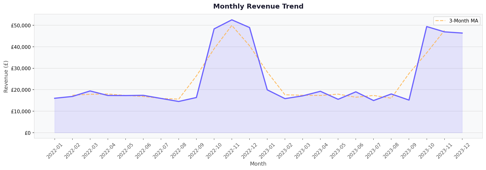
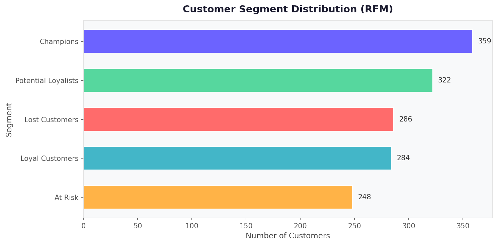
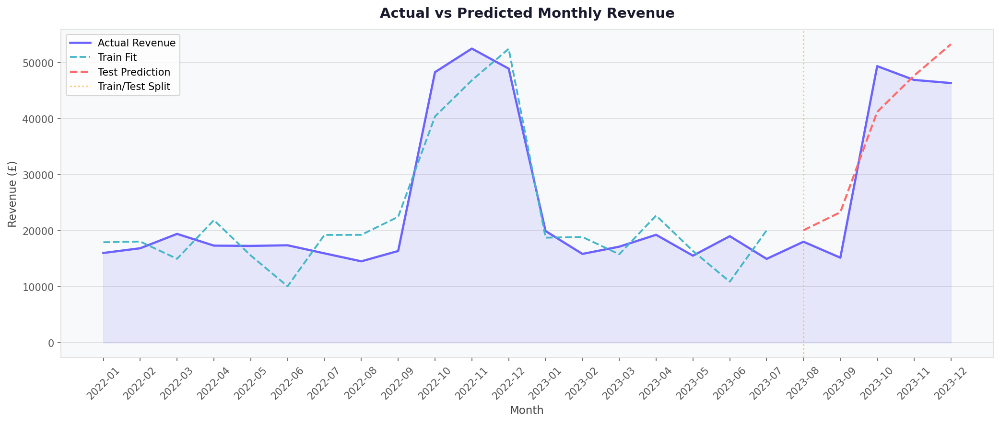
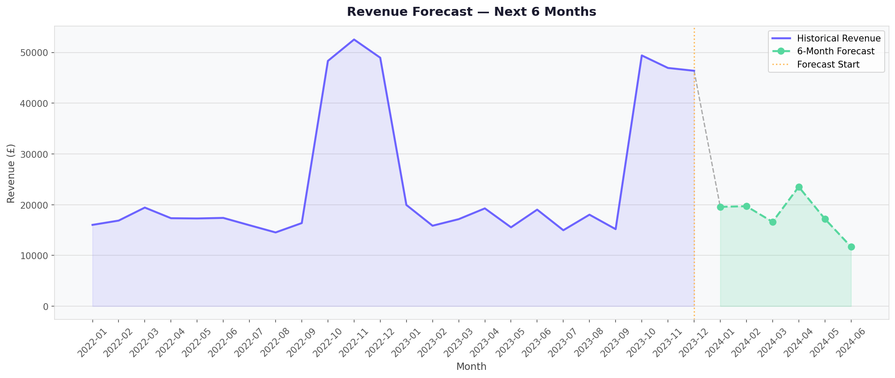

# 🛒 E-Commerce Customer & Revenue Analytics Platform

> A production-quality, end-to-end data analytics project demonstrating the full skill set of a professional Data Analyst — from raw data cleaning through to customer segmentation, forecasting, SQL analytics, and Power BI-ready dashboards.

[](https://python.org)
[](https://pandas.pydata.org)
[](https://scikit-learn.org)
[](https://sqlite.org)
[](https://jupyter.org)

---

## 📋 Table of Contents

- [Project Overview](#project-overview)
- [Architecture](#architecture)
- [Features](#features)
- [Project Structure](#project-structure)
- [Installation](#installation)
- [Usage](#usage)
- [Notebooks](#notebooks)
- [SQL Analytics](#sql-analytics)
- [KPI Metrics](#kpi-metrics)
- [Customer Segmentation](#customer-segmentation)
- [Forecasting](#forecasting)
- [Dashboard](#dashboard)
- [Screenshots](#screenshots)
- [Future Improvements](#future-improvements)

---

## 🎯 Project Overview

This platform analyses e-commerce transaction data to deliver:

| Analysis | Output |
|----------|--------|
| Data Cleaning | Cleaned CSV + quality report |
| Exploratory Analysis | 7 professional charts |
| KPI Tracking | 8 business metrics (JSON + CSV) |
| Customer Segmentation | 5-group RFM analysis |
| Revenue Forecasting | 6-month ahead prediction |
| SQL Analytics | 10 optimised queries |
| Power BI Dashboard | Ready-to-import CSV |
| Business Report | Auto-generated Markdown report |

**Dataset:** Synthetic 10,000-row e-commerce dataset modelled after the UCI Online Retail dataset, with realistic dirty data injected for cleaning demonstration.

---
## Key Results

* Processed 10,300 raw e-commerce transactions
* Cleaned and validated 8,455 records after removing duplicates and invalid data
* Generated £598,799.86 in analyzed revenue
* Identified 1,499 unique customers
* Achieved 94.17% customer retention rate
* Achieved 97.93% repeat purchase rate
* Segmented customers into 5 RFM categories
* Built a revenue forecasting model with R² = 0.84
* Generated 11 analytical visualizations and dashboard-ready datasets

## 🏗️ Architecture

```
Raw CSV Data
     │
     ▼
┌─────────────────────────────────────────────────────────────────┐
│                     DATA CLEANING LAYER                         │
│  • Remove duplicates   • Handle nulls   • Remove invalid rows   │
│  • Feature engineering: Revenue, Date parts, YearMonth          │
└──────────────────────────┬──────────────────────────────────────┘
                           │  cleaned_data.csv
          ┌────────────────┼───────────────────┐
          ▼                ▼                   ▼
┌──────────────┐  ┌──────────────────┐  ┌───────────────────┐
│ KPI ANALYSIS │  │ EDA (7 Charts)   │  │ SQLite Database   │
│ • Revenue    │  │ • Trends         │  │ • 3 tables        │
│ • Orders     │  │ • Products       │  │ • 10 SQL queries  │
│ • Customers  │  │ • Countries      │  │ • Indexed         │
│ • AOV        │  │ • Distribution   │  └───────────────────┘
│ • Retention  │  │ • Correlation    │
└──────────────┘  └──────────────────┘
          │
          ▼
┌─────────────────────────────────────────────────────────────────┐
│                   CUSTOMER SEGMENTATION (RFM)                   │
│  Recency + Frequency + Monetary → 5 Segments → Charts           │
└─────────────────────────────────────────────────────────────────┘
          │
          ▼
┌─────────────────────────────────────────────────────────────────┐
│                   FORECASTING MODULE                            │
│  Linear Regression → MAE, MSE, R² → 6-Month Prediction         │
└─────────────────────────────────────────────────────────────────┘
          │
          ▼
┌─────────────────────────────────────────────────────────────────┐
│               DASHBOARD & REPORT GENERATION                     │
│  Power BI CSV  |  Business Report (Markdown)                    │
└─────────────────────────────────────────────────────────────────┘
```

---

## ✨ Features

- **🧹 Data Cleaning** — Handles nulls, duplicates, cancellations, negative quantities, invalid prices
- **🔧 Feature Engineering** — Revenue, OrderYear/Month/Day, YearMonth, Customer Lifetime Revenue
- **📊 7 EDA Charts** — Monthly trends, top products, country analysis, distributions, correlation heatmap
- **📏 8 KPI Metrics** — Revenue, Orders, Customers, AOV, Retention Rate, Repeat Purchase Rate, Growth
- **🧩 RFM Segmentation** — 5 customer groups with 4 visualisation charts
- **🤖 ML Forecasting** — Linear Regression with seasonal features, MAE/MSE/R² evaluation
- **🗄️ SQL Analytics** — 10 optimised queries across all business dimensions
- **📤 Power BI Export** — Structured CSV ready for immediate import
- **📄 Business Report** — Auto-generated markdown report with real computed values
- **🚀 One-Command Pipeline** — `python main.py` runs everything

---

## 📁 Project Structure

```
Ecommerce_Analytics_Platform/
├── data/
│   ├── raw/
│   │   └── ecommerce_data.csv          # Synthetic raw dataset (10K rows)
│   └── processed/
│       ├── cleaned_data.csv            # Cleaned transactions
│       ├── customer_summary.csv        # Per-customer aggregates
│       ├── rfm_segments.csv            # RFM customer segments
│       ├── forecast_results.csv        # 6-month forecast
│       ├── forecast_metrics.json       # MAE, MSE, R² scores
│       ├── kpis.json                   # All KPI metrics
│       └── ecommerce.db                # SQLite database
│
├── sql/
│   ├── schema.sql                      # Database schema + indexes
│   ├── data_import.sql                 # Import instructions
│   └── analysis_queries.sql           # 10 business SQL queries
│
├── notebooks/
│   ├── 01_data_cleaning.ipynb          # Interactive cleaning walkthrough
│   ├── 02_exploratory_analysis.ipynb   # 7 EDA charts
│   ├── 03_customer_segmentation.ipynb  # RFM analysis
│   ├── 04_forecasting.ipynb            # ML forecasting
│   └── 05_business_insights.ipynb     # Full business summary
│
├── src/
│   ├── generate_data.py                # Synthetic dataset generator
│   ├── data_cleaning.py                # Cleaning pipeline
│   ├── kpi_analysis.py                 # KPI computation
│   ├── eda_visualizations.py           # 7 EDA charts
│   ├── customer_segmentation.py        # RFM segmentation
│   ├── forecasting.py                  # Linear Regression forecasting
│   ├── dashboard_data_generator.py     # Power BI dataset builder + SQLite
│   └── report_generator.py            # Business report generator
│
├── dashboard/
│   ├── dashboard_mockup.md             # Power BI layout & DAX guide
│   └── dashboard_dataset.csv          # Power BI-ready export
│
├── visualizations/                     # 11 PNG charts (auto-generated)
│   ├── 01_monthly_revenue_trend.png
│   ├── 02_top_20_products.png
│   ├── 03_revenue_by_country.png
│   ├── 04_customer_purchase_distribution.png
│   ├── 05_revenue_distribution.png
│   ├── 06_correlation_heatmap.png
│   ├── 07_revenue_growth_rate.png
│   ├── rfm_segment_distribution.png
│   ├── rfm_scatter.png
│   ├── actual_vs_predicted.png
│   └── revenue_forecast.png
│
├── reports/
│   ├── business_report.md              # Auto-generated business report
│   └── pipeline.log                   # Pipeline execution log
│
├── requirements.txt
├── main.py                             # ← Run this!
└── README.md
```

---

## 🛠️ Installation

### Prerequisites
- Python 3.10+
- pip

### Setup

```bash
# 1. Clone the repository
git clone https://github.com/yourusername/ecommerce-analytics-platform.git
cd ecommerce-analytics-platform

# 2. Create virtual environment (recommended)
python -m venv venv
venv\Scripts\activate          # Windows
# source venv/bin/activate      # macOS/Linux

# 3. Install dependencies
pip install -r requirements.txt
```

---

## 🚀 Usage

### Option 1: Run Full Pipeline (Recommended)

```bash
python main.py
```

This single command executes all 8 pipeline steps and generates every output file.

**Expected runtime:** ~30–60 seconds

### Option 2: Run Individual Modules

```bash
# Generate raw dataset
python src/generate_data.py

# Clean data
python src/data_cleaning.py

# Compute KPIs
python src/kpi_analysis.py

# Generate EDA charts
python src/eda_visualizations.py

# Run RFM segmentation
python src/customer_segmentation.py

# Run forecasting
python src/forecasting.py

# Build dashboard dataset
python src/dashboard_data_generator.py

# Generate business report
python src/report_generator.py
```

### Option 3: Jupyter Notebooks

```bash
jupyter notebook notebooks/
```

Run notebooks in order: `01` → `02` → `03` → `04` → `05`

---

## 📓 Notebooks

| Notebook | Description | Key Output |
|----------|-------------|------------|
| `01_data_cleaning.ipynb` | Interactive cleaning walkthrough with before/after comparisons | Cleaned CSV |
| `02_exploratory_analysis.ipynb` | 7 EDA charts with inline display | 7 PNG charts |
| `03_customer_segmentation.ipynb` | RFM scoring and segment visualisations | RFM CSV + 4 charts |
| `04_forecasting.ipynb` | Model training, metrics, actual vs predicted | 2 forecast charts |
| `05_business_insights.ipynb` | Full KPI dashboard, top customers/products, report generation | Business report |

---

## 🗄️ SQL Analytics

The `sql/analysis_queries.sql` file contains 10 optimised queries:

```sql
-- 1. Top 10 Customers by Lifetime Revenue
SELECT CustomerID, TotalOrders, LifetimeRevenue
FROM transactions
GROUP BY CustomerID
ORDER BY LifetimeRevenue DESC LIMIT 10;

-- 2. Monthly Revenue Summary
SELECT YearMonth, COUNT(DISTINCT InvoiceNo) AS Orders,
       ROUND(SUM(Revenue), 2) AS MonthlyRevenue
FROM transactions GROUP BY YearMonth ORDER BY YearMonth;

-- 3. RFM Segment Performance
SELECT Segment, COUNT(*) AS Customers,
       ROUND(AVG(Monetary), 2) AS AvgValue
FROM rfm_segments GROUP BY Segment;
```

*Full queries available in [`sql/analysis_queries.sql`](sql/analysis_queries.sql)*

---

## 📏 KPI Metrics

| KPI | Definition |
|-----|-----------|
| **Total Revenue** | `SUM(Quantity × UnitPrice)` |
| **Total Orders** | `COUNT(DISTINCT InvoiceNo)` |
| **Total Customers** | `COUNT(DISTINCT CustomerID)` |
| **Average Order Value** | `Total Revenue / Total Orders` |
| **Revenue per Customer** | `Total Revenue / Total Customers` |
| **Repeat Purchase Rate** | `% customers with >1 order` |
| **Customer Retention Rate** | `% H1 customers who also purchased in H2` |
| **Monthly Growth Rate** | `Month-over-Month % change in revenue` |

---

## 🧩 Customer Segmentation

RFM analysis uses quantile-based scoring (1–4 scale):

| Segment | Criteria | Strategy |
|---------|----------|----------|
| **Champions** | High R, F, M | Reward and retain |
| **Loyal Customers** | High R, mid-high F | Upsell premium products |
| **Potential Loyalists** | Recent, growing | Nurture with engagement |
| **At Risk** | Low recency, high F/M | Re-engagement campaigns |
| **Lost Customers** | Low R, F, M | Win-back offers |

---

## 📈 Forecasting

| Property | Detail |
|----------|--------|
| **Model** | Linear Regression (sklearn) |
| **Features** | TimeIndex, MonthSin, MonthCos, Quarter |
| **Split** | 80% train / 20% test (chronological) |
| **Horizon** | 6 months ahead |
| **Metrics** | MAE, MSE, RMSE, R² |

---

## 📊 Dashboard

The `dashboard/dashboard_dataset.csv` file is structured for Power BI:

| Column | Description |
|--------|-------------|
| `Period` | YearMonth or "ALL" |
| `Metric` | KPI name |
| `Value` | Numeric value |
| `Category` | Revenue / Customer / Product / Geography / Forecast |

**Import Steps:**
1. Open Power BI Desktop
2. Home → Get Data → Text/CSV → select `dashboard_dataset.csv`
3. Use `Category` as a slicer to filter views
4. See [`dashboard/dashboard_mockup.md`](dashboard/dashboard_mockup.md) for page layouts and DAX formulas

---

## 📸 Screenshots

### Monthly Revenue Trend


### Customer Segment Distribution


### Actual vs Predicted Revenue


### Revenue Forecast

---

## 🔮 Future Improvements

| Enhancement | Description |
|-------------|-------------|
| **Advanced ML** | XGBoost / LightGBM for better forecast accuracy |
| **ARIMA / Prophet** | Purpose-built time-series forecasting models |
| **Real-time Dashboard** | Streamlit or Dash web app |
| **Cohort Analysis** | Monthly customer cohort retention heatmaps |
| **A/B Testing Framework** | Statistical testing for promotions |
| **Predictive CLV** | Pareto/NBD model for future customer value |
| **Geographic Maps** | Choropleth maps with Plotly |
| **Email Automation** | Automated segment-based campaign triggers |
| **Docker** | Containerised deployment |
| **CI/CD** | GitHub Actions for automated testing |

---

## 📄 License

MIT License — free to use, modify, and distribute with attribution.

---

*Built with ❤️ using Python, Pandas, Scikit-learn, and SQLite*
